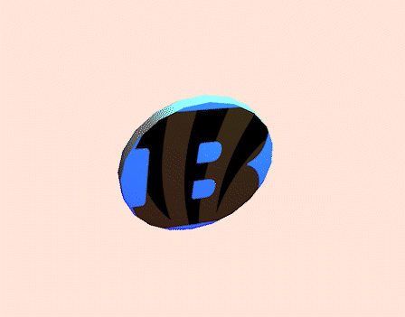

# Coin Flipper

### Setup
1. Get Node and Yarn package manager
2. `yarn add vite three`
3. `yarn create vite`
4. Hit enter, enter, enter to create a default Vite project
5. `cd vite-project && yarn install`
6. `yarn run dev`

### Create the coin flip
1. Open `index.html` and swap the div tag for the canvas tag
2. Add your desired images inside the `vite-project` directory
3. Open `main.js` and only keep the import line for `style.css`
4. Use the three.js docs defaults for rendering a scene, camera, and lighting
5. Use the `THREE.TextureLoader()` to load both images as textures and create materials out of them
6. Create a materials array with the edge material first
7. Create the coin geometry using the `THREE.CylinderGeometry`
8. Create the coin mesh using the coin geometry and coin materials array
9. Animate the coin by incrementing the rotation on every animation frame